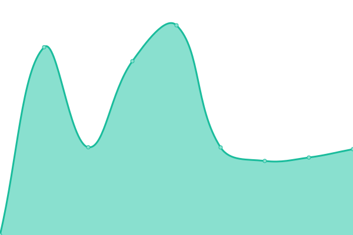
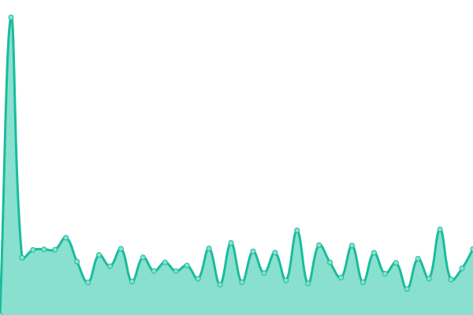

# [📈 Live Status](https://hoangthuan24062002.github.io/upp): <!--live status--> **🟧 Partial outage**

This repository contains the open-source uptime monitor and status page for [hoangthuan24062002](https://hoangthuan24062002.github.io/upp), powered by [Upptime](https://github.com/upptime/upptime).

With [Upptime](https://upptime.js.org), you can get your own unlimited and free uptime monitor and status page, powered entirely by a GitHub repository. We use [Issues](https://github.com/hoangthuan24062002/upp/issues) as incident reports, [Actions](https://github.com/hoangthuan24062002/upp/actions) as uptime monitors, and [Pages](https://hoangthuan24062002.github.io/upp) for the status page.

<!--start: status pages-->
<!-- This summary is generated by Upptime (https://github.com/upptime/upptime) -->
<!-- Do not edit this manually, your changes will be overwritten -->
<!-- prettier-ignore -->
| URL | Status | History | Response Time | Uptime |
| --- | ------ | ------- | ------------- | ------ |
|  [Google](https://www.google.com) | 🟩 Up | [google.yml](https://github.com/hoangthuan24062002/upp/commits/HEAD/history/google.yml) | 

 115ms
     
 | 

<a href="https://hoangthuan24062002.github.io/upp/history/google">100.00%</a>
    

|  [QBU](https://qbu.edu.vn) | 🟩 Up | [qbu.yml](https://github.com/hoangthuan24062002/upp/commits/HEAD/history/qbu.yml) | 

 2324ms
     
 | 

<a href="https://hoangthuan24062002.github.io/upp/history/qbu">99.83%</a>
    

|  [Quan ly dao tao](http://daotao.quangbinhuni.edu.vn) | 🟩 Up | [quan-ly-dao-tao.yml](https://github.com/hoangthuan24062002/upp/commits/HEAD/history/quan-ly-dao-tao.yml) | 

 1218ms
     
 | 

<a href="https://hoangthuan24062002.github.io/upp/history/quan-ly-dao-tao">100.00%</a>
    

|  [Tai nguyen mo](http://lrc.quangbinhuni.edu.vn:8383/dspace) | 🟥 Down | [tai-nguyen-mo.yml](https://github.com/hoangthuan24062002/upp/commits/HEAD/history/tai-nguyen-mo.yml) | 

 0ms
     
 | 

<a href="https://hoangthuan24062002.github.io/upp/history/tai-nguyen-mo">0.00%</a>
    

|  [Tap chi khoa hoc](http://tckh.qbu.edu.vn/index.php/tckh) | 🟩 Up | [tap-chi-khoa-hoc.yml](https://github.com/hoangthuan24062002/upp/commits/HEAD/history/tap-chi-khoa-hoc.yml) | 

 7731ms
     
 | 

<a href="https://hoangthuan24062002.github.io/upp/history/tap-chi-khoa-hoc">99.73%</a>
    

|  [UBND tinh Quang Binh](https://quangbinh.gov.vn) | 🟩 Up | [ubnd-tinh-quang-binh.yml](https://github.com/hoangthuan24062002/upp/commits/HEAD/history/ubnd-tinh-quang-binh.yml) | 

 5651ms
     
 | 

<a href="https://hoangthuan24062002.github.io/upp/history/ubnd-tinh-quang-binh">100.00%</a>
    

|  [Bo GDDT](https://moet.gov.vn/Pages/home.aspx) | 🟥 Down | [bo-gddt.yml](https://github.com/hoangthuan24062002/upp/commits/HEAD/history/bo-gddt.yml) | 

 2737ms
     
 | 

<a href="https://hoangthuan24062002.github.io/upp/history/bo-gddt">100.00%</a>
    

|  [Test Broken Site](https://thissitedoesnotexist.koj.co) | 🟥 Down | [test-broken-site.yml](https://github.com/hoangthuan24062002/upp/commits/HEAD/history/test-broken-site.yml) | 

 0ms
     
 | 

<a href="https://hoangthuan24062002.github.io/upp/history/test-broken-site">100.00%</a>
    

<!--end: status pages-->

[**Visit our status website →**](https://hoangthuan24062002.github.io/upp)

## 📄 License

- Powered by: [Upptime](https://github.com/upptime/upptime)
- Code: [MIT](./LICENSE) © [hoangthuan24062002](https://hoangthuan24062002.github.io/upp)
- Data in the `./history` directory: [Open Database License](https://opendatacommons.org/licenses/odbl/1-0/)
